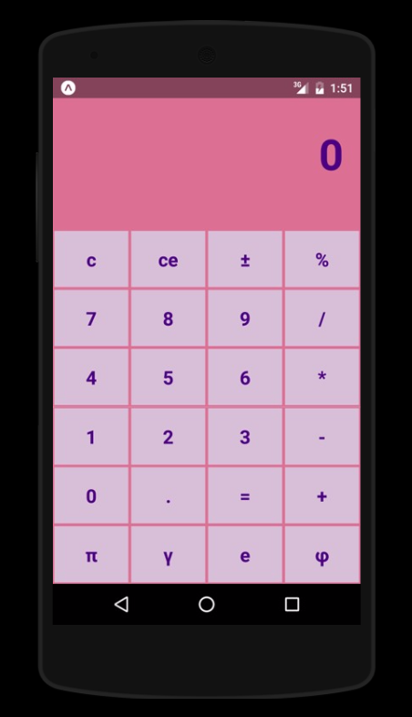
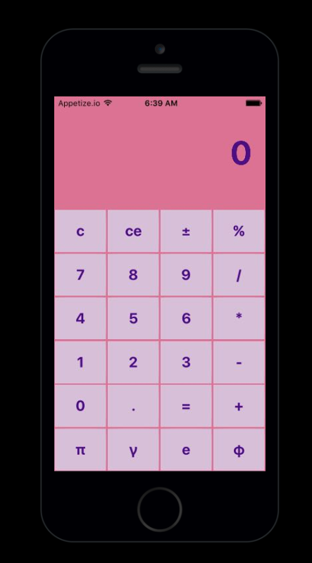

# Calculator

For a simple calculator application with React-Native, We benefit from the <a href="https://snack.expo.io/">website</a> in this project. When the calculator application was developed, JavaScript's eval() function, which is important to us, was used.  The eval() function allows it to be executed dynamically by converting the character array parameter it receives into JavaScript source code. If the character sequence contains one or more operators, the operator is executed. Eval() automatically detects the type of variable and performs the conversion and performs the mathematical operation. 

You can see here usage of eval() function:

                  inputValue: eval(temp + operation + inputValue),
                  

ScreenShots of Application (Android and iOS):

  
